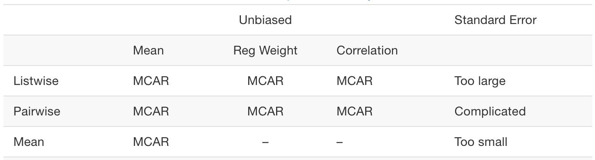

## Packages You Need

Install these packages first if you haven't already. You only need to install once.

```{r install-packages}
# Run this ONCE to install packages
# #install.packages(c("tidyverse", "janitor", "skimr",
#                    "psych", "naniar", "readxl", "diffdf"))
```

Load the packages at the start of every session:

```{r load-packages, eval=TRUE, message=FALSE}
library(tidyverse)    # Data manipulation and visualization
library(janitor)      # Clean variable names and tabulations
library(skimr)        # Quick summary statistics
library(psych)        # Descriptive statistics
library(naniar)       # Missing data visualization and analysis
library(readxl)       # Read Excel files
library(diffdf)       # Compare two data frames
```

## Codebooks and Data Entry

A **codebook** is a document that describes every variable in your dataset. It typically includes variable names and labels, value codes and their meanings, missing data codes, and any special instructions for using the data. Always keep a codebook alongside your data file.

Our codebook documents the following types of variables:

| Variable type | Variables | Values |
|:-----------------------|:-----------------------|:-----------------------|
| Single choice | `program`, `Gender`, `NativeSpeaker`, `FutureUse` | Numeric codes (see codebook) |
| Checkbox (binary) | `StatisticalMethods_*`, `Software_*`, `Experience_*` | 0 = not selected, 1 = selected |
| Ordinal confidence | `Ability_Confidence1–7`, `Learning_Confidence1–7` | 1–4 scale |

**Missing data codes:** values 7, 8, and 9 indicate "multiple options selected", "other responses", and "no response" respectively. These will be treated as missing (`NA`).

## Import Your Data

### Reading an Excel File

R can read Excel files using the `readxl` package. The EPSY 5244 survey data file has two sheets.

```{r import-data}
data_url <- "https://raw.githubusercontent.com/Wenchao-Ma/Data/main/Course_survey/course_survey.xlsx"
data_file <- tempfile(fileext = ".xlsx")
download.file(data_url, destfile = data_file, mode = "wb", quiet = TRUE)

df <- readxl::read_excel(data_file, sheet = "data")
```

### Comparing Two Sheets

This file has two sheets — `data` and `second_entry` — representing data entered by two different people. Before proceeding, check whether the two entries agree.

```{r compare-sheets}
# Read both sheets
df  <- readxl::read_excel(data_file, sheet = "data")
df2 <- readxl::read_excel(data_file, sheet = "second_entry")

# Compare dimensions
dim(df)
dim(df2)

# Quick check: are the two sheets identical?
identical(df, df2)
```

Use `diffdf::diffdf()` to find exactly what differs:

```{r compare-sheets-diffdf}
# Reports variables, rows, and cells that differ
diffdf::diffdf(df, df2)
```

`diffdf::diffdf()` reports:

-   **Variables** present in one sheet but not the other
-   **Rows** present in one sheet but not the other
-   **Cell-level differences**: values that differ between corresponding rows and columns

If no differences are found, the function returns silently (no output). Investigate any differences and resolve them before proceeding.

## Step 0: Look at Your Data!

Before doing any formal cleaning, **always look at your data first**. Get familiar with the variables, their types, and their values. Take notes on anything that looks unusual.

### Basic Inspection

```{r look-at-data}
# View the first 6 rows
head(df)

# Check the dimensions: how many rows (observations) and columns (variables)?
dim(df)
nrow(df)  # number of rows
ncol(df)  # number of columns

# See the structure of the dataset
str(df)

# A tidyverse alternative: glimpse
dplyr::glimpse(df)

# View variable names
names(df)

```

### Quick Overview with `skim()`

The `skim()` function from the `skimr` package provides a comprehensive overview in one command:

```{r skim-data}
skimr::skim(df)
```

This shows the number of rows and columns, data types, missing values, and basic summary statistics for every variable—a great first step.

## Cosmetic Data Cleaning

Cosmetic cleaning makes your variables **easy to understand at face value**. It doesn't change the data values—just how they're named and labeled.

### Clean Variable Names

Variable names from Qualtrics often contain mixed capitalization and special characters. The `clean_names()` function standardizes them to lowercase with underscores:

```{r clean-names}
# Before cleaning
names(df)

# Clean all names: lowercase, underscores instead of spaces/special characters
df <- df %>%
  janitor::clean_names()

# After cleaning
names(df)
# e.g., "StatisticalMethods_ANOVA" becomes "statisticalmethods_anova"
#       "Gender" becomes "gender"
```

### Assign Factor Labels to Categorical Variables

Since the data comes from Excel (no built-in value labels), we manually assign labels to categorical variables using base R `factor()`, guided by the codebook.

For **single-choice** variables:

```{r assign-factors}
df <- df %>%
  dplyr::mutate(
    # program: 1 = master's, 2 = doctoral, 3 = other
    program = factor(program,
                     levels = 1:3,
                     labels = c("Master's", "Doctoral", "Other")),

    # gender: 1 = male, 2 = female, 3 = nonbinary, 4 = prefer not to say
    gender = factor(gender,
                    levels = 1:4,
                    labels = c("Male", "Female", "Nonbinary", "Prefer not to say")),

    # nativespeaker: 1 = no, 2 = yes
    native_speaker = factor(native_speaker,
                           levels = 1:2,
                           labels = c("No", "Yes")),

    # futureuse: 1 = no, 2 = yes
    future_use = factor(future_use,
                       levels = 1:2,
                       labels = c("No", "Yes"))
  )
```

For multiple-selected (checkbox) items, treat them as binary factors (selected vs. not selected). These are nominal indicators, so we do **not** set `ordered = TRUE`.

```{r assign-ordered-factors2}

df <- df %>%
  dplyr::mutate(dplyr::across(
    c(dplyr::starts_with("statistical_methods"),
      dplyr::starts_with("software"),
      dplyr::starts_with("experience")),
    ~ factor(., levels = 0:1, labels = c("not selected", "selected"))
  ))
```

For ordinal confidence items, use `ordered = TRUE` because the response options have a natural order from low to high:

```{r assign-ordered-factors}
confidence_labels <- c("No confidence", "A fair amount", "Much", "Complete")

df <- df %>%
  dplyr::mutate(dplyr::across(
    c(dplyr::starts_with("ability_confidence"),
      dplyr::starts_with("learning_confidence")),
    ~ factor(., levels = 1:4, labels = confidence_labels, ordered = TRUE)
  ))
```

> **Note on missing codes:** The codebook defines values 7, 8, and 9 as missing (multiple options selected, other response, no response). Because these values are not included in the `levels` argument, `factor()` automatically converts them to `NA`. No separate recoding step is needed.

After conversion, verify the results:

```{r verify-factors}
# Check structure
str(df)

# See the first few rows
head(df)
```

## Diagnostic Data Cleaning

Diagnostic cleaning detects **substantive problems** in the data—values that are impossible, implausible, or inconsistent.

### Check Unique Identifiers

Every dataset should have a variable that **uniquely identifies** each observation. In this dataset, `id` serves that role (values like "A1", "A2", etc.).

If an ID appears more than once, it may indicate duplicate entries or a data entry error.

```{r check-ids}
# How many rows vs. how many unique IDs?
nrow(df)
dplyr::n_distinct(df$id)
```

```{r find-duplicates}
# Find IDs that appear more than once
df %>%
  dplyr::count(id) %>%
  dplyr::filter(n > 1)
```

If you find duplicates, investigate: Are they true duplicates (same row entered twice)? Decide whether to remove them based on your study design.

### Check for Implausible Values: All Variables

Use a `for` loop with `table()` to quickly scan every variable for unexpected values:

```{r freq-all}
for (var in names(df)) {
  cat("\n---", var, "---\n")
  print(table(df[[var]], useNA = "ifany"))
}
```

**What to look for:**

-   For single-choice variables (`program`, `gender`, etc.): after factor conversion, any `NA` values came from out-of-range codes (7/8/9). Check whether the number of `NA`s is reasonable.
-   For checkbox binary variables (`statisticalmethods_*`, `software_*`, `experience_*`): only values 0 and 1 are valid.
-   For confidence items (`ability_confidence*`, `learning_confidence*`): only levels 1–4 are valid; others become `NA`.

### Check for Implausible Response Combinations

Some response combinations are logically impossible. The "none of the above" options (`statisticalmethods_noa`, `software_noa`) should be mutually exclusive with the other items in the same group.

```{r implausible-combos}
# If statisticalmethods_noa = 1, all other StatisticalMethods items should be 0
table(df$statistical_methods_noa, df$statistical_methods_introstats,
      dnn = c("None of above", "Intro stats"))


```

## Visualize Data for Quality Checks

Visualizations can reveal patterns that numbers alone might miss.

### Bar Charts for Categorical Variables

```{r bar-charts, fig.width=8, fig.height=5}
# Bar chart for program type
ggplot2::ggplot(df, ggplot2::aes(x = program)) +
  ggplot2::geom_bar(fill = "steelblue") +
  ggplot2::labs(x = "Program", y = "Count",
                title = "Distribution of Program Type") +
  ggplot2::theme_minimal()

# Bar chart for gender
ggplot2::ggplot(df, ggplot2::aes(x = gender)) +
  ggplot2::geom_bar(fill = "steelblue") +
  ggplot2::labs(x = "Gender", y = "Count",
                title = "Distribution of Gender") +
  ggplot2::theme_minimal()
```

### Bar Charts for Ordinal (Confidence) Variables

Since the confidence items are ordered factors (not continuous numbers), bar charts are appropriate:

```{r confidence-charts, fig.width=8, fig.height=5}
# Distribution of Ability_Confidence1: "Writing good survey questions"
ggplot2::ggplot(df, ggplot2::aes(x = ability_confidence1)) +
  ggplot2::geom_bar(fill = "steelblue") +
  ggplot2::labs(x = "Confidence level",
                y = "Count",
                title = "Ability Confidence: Writing good survey questions") +
  ggplot2::theme_minimal() +
  ggplot2::theme(axis.text.x = ggplot2::element_text(angle = 20, hjust = 1))
```

## Missing Data

After factor conversion, missing codes (7, 8, 9) have already been converted to `NA`. Before summarizing or visualizing missingness, it helps to understand *why* data are missing—because the reason determines what you can do about it.

### Understanding Missing Data Mechanisms

There are three mechanisms that explain why data are missing, each with different implications for analysis:

If the probability of being missing is the same for all cases, then the data are said to be missing completely at random (MCAR). Data is missing independently of both observed and unobserved variables.

-   In a paper survey, a participant accidentally skips a page, leaving several questions blank.

-   A respondent misses a question because they were distracted, not because of the question's content.

-   A random error in data entry phase.

If the probability of being missing is the same only within groups defined by the *observed* data, then the data are missing at random (MAR). The probability of missing data is related to other observed data in the survey, but not the missing value itself.

-   Participants who fill out a very long survey stop answering at the end (missingness depends on question order, which is observed)

-   In a salary survey, women might be less likely to report their income, but the missingness is related to gender (observed), not the income amount itself.

If neither MCAR nor MAR holds, then we speak of missing not at random (MNAR). In the literature one can also find the term NMAR (not missing at random) for the same concept. MNAR means that the probability of being missing varies for reasons that are unknown to us. The probability of missing data depends on the unobserved data itself (the value that should have been recorded).

-   Individuals with very high incomes refuse to disclose their salary in a survey.

-   Respondents with extreme political views skip questions asking for their stance to avoid taking a position.

> **Why does it matter?** Knowing the mechanism guides your choice of how to handle missingness.

### Ad-hoc solutions

Complete-case analysis (listwise deletion): The procedure eliminates all cases with one or more missing values on the analysis variables. If the data are MCAR, listwise deletion produces unbiased estimates of means, variances and regression weights. Under MCAR, listwise deletion produces standard errors and significance levels that are correct for the reduced subset of data, but that are often larger relative to all available data.

Pairwise deletion, also known as available-case analysis, attempts to remedy the data loss problem of listwise deletion. Under MCAR, it produces consistent estimates of mean, correlations and covariances. The estimates can be biased if the data are not MCAR. Further, the covariance and/or correlation matrix may not be positive definite. Pairwise deletion works best used if the data approximate a multivariate normal distribution, if the correlations between the variables are low, and if the assumption of MCAR is plausible. It is not recommended for other cases.

Mean imputation replaces the missing data by the mean. It will underestimate the variance, disturb the relations between variables, bias almost any estimate other than the mean and bias the estimate of the mean when data are not MCAR and thus it should be avoided in general.




### Exploring MAR: Is Missingness Related to Observed Variables?

If missingness on a variable is *predictable* from other observed variables, the data are likely MAR (which is manageable). If not, NMAR is a concern.

A simple approach: create a binary indicator (1 = missing, 0 = observed) for the variable of interest, then see whether other variables predict it.

```{r explore-mar}
# Create a missingness indicator for gender (1 = missing, 0 = observed)
df <- df %>%
  dplyr::mutate(gender_missing = as.integer(is.na(gender)))

# Does program predict whether gender is missing?
table(df$program, df$gender_missing,
      dnn = c("Program", "Gender missing"))

# For a more formal test, use logistic regression
summary(glm(gender_missing ~ program, data = df, family = binomial))

# Remove temporary indicator so it does not affect later summaries/plots
df <- df %>%
  dplyr::select(-gender_missing)
```

If `program` is a significant predictor of `gender` being missing, that is evidence of MAR (not MCAR). The missing data are systematically related to something we *did* observe.

> **NMAR** cannot be formally tested from the data alone—by definition, it depends on the unobserved values. If you have theoretical reasons to believe missingness is related to the missing value itself (e.g., sicker patients more likely to drop out of a health study), acknowledge this as a limitation and consider sensitivity analyses.

### Numerical Summaries

```{r check-missing-summary}
# Count and percentage of NAs per variable
naniar::miss_var_summary(df)

# Count and percentage of NAs per case (row)
naniar::miss_case_summary(df)

# Overall missing data rate
naniar::pct_miss(df)
```

`miss_var_summary()` returns a tidy table sorted by most missing, making it easy to spot which variables have the most non-responses.

### Visualizing Missing Data

```{r check-missing-viz, fig.width=9, fig.height=5}
# Bar chart: % missing per variable
naniar::gg_miss_var(df) +
  ggplot2::labs(title = "Missing data by variable") +
  ggplot2::theme_minimal()

# Heatmap: which cases are missing which variables
naniar::vis_miss(df) +
  ggplot2::labs(title = "Missing data pattern") +
  ggplot2::theme(axis.text.x = ggplot2::element_text(angle = 45, hjust = 1))
```

`vis_miss()` gives a row-by-column heatmap where each black cell marks a missing value — useful for spotting whether missingness is random or concentrated in specific cases.

### Exploring Co-occurrence of Missingness

```{r check-missing-upset, fig.width=8, fig.height=5}
# Which variables tend to be missing together?
naniar::gg_miss_upset(df)
```

The upset plot shows how many cases are missing combinations of variables simultaneously. For example, if `gender` and `program` are always missing together, that suggests a systematic pattern (e.g., a respondent skipped a whole section).

## Try It!

Use the EPSY 5244 begin-semester survey dataset you just entered to complete the following exercises:

1.  **Import** the `data` sheet and check its dimensions.
2.  **Compare** the two sheets using `diffdf::diffdf()`. Are they the same? If not, what differs?
3.  **Inspect** the data using `dplyr::glimpse()`, `skimr::skim()`, and `View()`.
4.  **Check** whether `id` uniquely identifies each row.
5.  **Clean variable names** and **assign factor labels** to all categorical variables.
6.  **Run a frequency table for every variable** using the `for` loop. Do any variables have unexpected values or surprising amounts of missing data?
7.  **Check** whether any respondent marked "none of the above" and also selected another option in the same group.
8.  **Create a bar chart** for `program` and another for `gender`.

## Quick Reference: Useful Functions

| Task | Function | Package |
|:-----------------|:---------------------------|:-------------------------|
| Import Excel file | `read_excel()` | readxl |
| List Excel sheets | `excel_sheets()` | readxl |
| Compare two data frames | `diffdf()` | diffdf |
| View structure | `glimpse()` | dplyr |
| Quick summary | `skim()` | skimr |
| Descriptive stats | `describe()` | psych |
| Clean variable names | `clean_names()` | janitor |
| Assign factor labels | `factor()` | base R |
| Frequency table (one variable) | `table()` | base R |
| Frequency table (all variables) | `for` loop + `table()` | base R |
| Frequency table with % | `tabyl()` + `adorn_pct_formatting()` | janitor |
| Cross-tabulation | `table()` | base R |
| Count values | `count()` | dplyr |
| Filter rows | `filter()` | dplyr |
| Recode/transform variables | `mutate()` | dplyr |
| Apply function to many columns | `across()` | dplyr |
| Test MCAR (Little's test) | `mcar_test()` | naniar |
| Summarize missing by variable | `miss_var_summary()` | naniar |
| Summarize missing by case | `miss_case_summary()` | naniar |
| Overall missing rate | `pct_miss()` | naniar |
| Bar chart of missing | `gg_miss_var()` | naniar |
| Missing data heatmap | `vis_miss()` | naniar |
| Missing co-occurrence plot | `gg_miss_upset()` | naniar |
| Bar chart | `geom_bar()` | ggplot2 |
| Save CSV | `write_csv()` | readr |
| Save R data | `saveRDS()` | base R |
