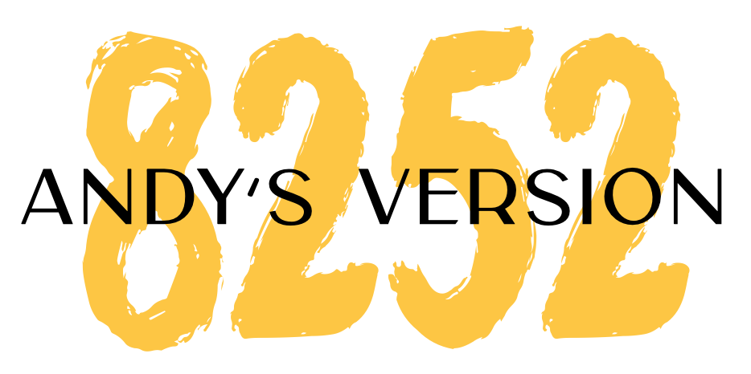

```{r}
#| include: false
htmltools::tagList(rmarkdown::html_dependency_font_awesome())
```

```{r}
#| fig-align: "center"
#| out-width: "60%"
#| echo: false
#| fig-alt: "Decorative image"
# 
```


## Welcome

EPsy 5244 (Survey Design, Sampling, and Implementation) is a 3-credit course. 

In this course you will develop an understanding of basic survey research methods, particularly those that apply to educational settings with research applications in education and the social sciences. You will develop a practical understanding of the principles of survey design and will learn best practices for survey research tasks such as procedures for item writing and revising items, selecting appropriate response formats (including the appropriate number of response categories), selecting an appropriate sample for a survey study, and dealing with missing data. 

This course aims to equip students with foundational skills in survey research methods, including the design of survey instruments, data collection, analysis, and interpretation. Upon completion, students will be able to:

- Evaluate Survey Methods: Assess the suitability of various survey research methods in different research contexts.
- Pretesting: Plan and conduct a pretesting to refine survey instruments.
- Identify Survey Errors: Recognize and address sources of different survey errors.
- Develop Sampling Designs: Create basic sampling designs appropriate for survey research.
- Select Analysis Methods: Choose suitable analysis methods for survey data.
- Write Proposals: Develop a comprehensive proposal for a survey research project.


It is expected that the academic work required of Graduate School and professional school students will exceed three hours per credit per week (see [Expected Time per Course Credit Policy](https://policy.umn.edu/education/timepercredit)). It is typical for students to spend 8--15 hours a week on this course. 
<br />


## Classroom

[Appleby Hall](https://campusmaps.umn.edu/appleby-hall)


## Instructor

**Name:** [Wenchao Ma](https://edpsych.umn.edu/people/quantitative-methods-education-faculty/wenchao-ma) <br />
**Email:** [wma@umn.edu](mailto://wma@umn.edu) <br />
**Office:** [Education Sciences Building 167](https://www.google.com/maps/place/Education+Sciences+Building/@44.9784043,-93.2394586,15z/data=!4m2!3m1!1s0x0:0x45656dac481b9150)  <br />
**Office Hours:** Tuesday 9:45 AM&ndash;10:45 AM; or by appointment <br />
**Virtual Office:** If you want to meet virtually, send me a Google calendar invite with title **Virtual Office hour EPSY 8252 - Your name** and include a Zoom link in the invite. 


## Textbooks


Required texts:

- Dillman, D.A., Smyth, J.D., & Christian, L.M. (2014). Internet, phone, mail, and mixed-mode surveys: The tailored design method (4th ed.). Hoboken, NJ: John Wiley & Sons, Inc. Free available through the University of Minnesota Libraries.
- Ruel, E., Wagner, W., & Gillespie, B. (2016).  [The practice of survey research. SAGE Publications, Inc](https://doi.org/10.4135/9781483391700) Free available through the University of Minnesota Libraries.
- Litwin, M. S. (2022). [How to assess and interpret survey psychometrics: A step-by-step guide to survey reliability and validity](https://methods.sagepub.com/book/mono/how-to-assess-interpret-survey-psychometrics/toc). SAGE Publications, Inc. Free available through the University of Minnesota Libraries.

Recommended texts:

- Gideon, L. (2012). Handbook of survey methodology for the social sciences (Vol. 513). New York: Springer.
- Lam, T. C. M., & Green, K. E. (2023). Survey Development: A Theory-Driven Mixed-Method Approach. Routledge. 
- Lohr, S. L. (2022). Sampling: Design and analysis (Third edition). CRC Press.
- Nardi, P. M. (2018). Doing survey research: A guide to quantitative methods. Routledge.
- Robinson, S. B., & Leonard, K. F. (2018). Designing quality survey questions. Sage publications. 

<br />


## Statistical Computing

To support your learning in survey data analysis, this course will emphasize the use of R. R is a free software environment for statistical computing and graphics. It compiles and runs on a wide variety of UNIX platforms, Windows and MacOS. It should be noted that while some R syntax and programming is taught during class time, there is also a fair amount that you may need to learn on your own outside of class.

- [Download and install R](https://www.r-project.org)
- [Download and install RStudio](https://posit.co/download/rstudio-desktop/)


You can install R and RStudio onto your local machine. (There are instructions for how to do this [here](https://zief0002.github.io/modeling/01-01-r-and-rstudio-installation.html).) You are responsible for getting things to work on your computer. While it should be straightforward, each OS and computer has their quirks. I can try to help you with this if you are having trouble.

While R is popular and widely used, it can be difficult to learn and not everyone needs to know how to use it. As a result, we will also use [Jamovi](https://www.jamovi.org/) for some of the data analysis exercises. Jamovi is a free and open statistical software that is built on top of R. It provides a user-friendly interface for conducting various statistical analyses without needing to write code. You can download and install Jamovi from their website. However, Jamovi cannot be used for all the analyses we will cover in this course, so you will still need to learn R for some of the assignments and exercises.

<br />

## Data

This course will use a series of datasets for in-class exercises and assignments. These datasets can be found [here](https://wenchao-ma.github.io/Data/). You are expected to download the datasets and use them for the relevant assignments and exercises.


<br />

<div class=inclusion role="none">
### A Note on Inclusion and Respect

In this class, we will work together to develop a learning community that is inclusive and respectful, and where every student is supported in the learning process. As a class full of diverse individuals (reflected by differences in race, culture, age, religion, gender identity, sexual orientation, socioeconomic background, abilities, professional goals, and other social identities and life experiences) I expect that different students may need different things to support and promote their learning. I will do everything we can to help with this, but as we only know what we know, we need you to communicate with us if things are not working for you or you need something we are not providing. I hope you all feel comfortable in helping to promote an inclusive classroom through respecting one another's individual differences, speaking up, and challenging oppressive/problematic ideas. Finally, I look forward to learning from each of you and the experiences you bring to the class. 
</div>


<br />


## Acknowledgments

- This course website is built using [Quarto](https://quarto.org/), an open-source scientific and technical publishing system built on Pandoc. The website is hosted on GitHub Pages. 
- The course website template is adapted from [Prof. Andrew Zieffler's EPSY 8252](https://zief0002.github.io/bespectacled-antelope/).


