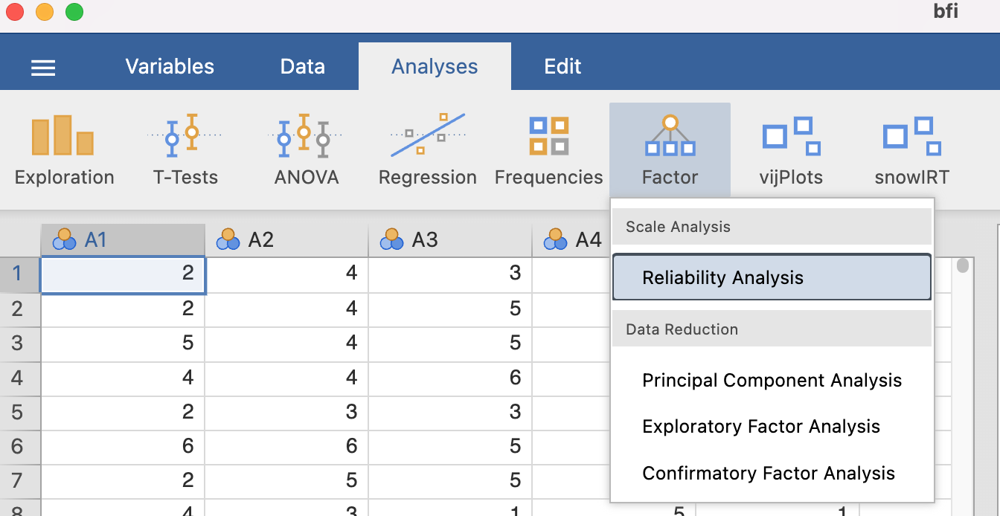
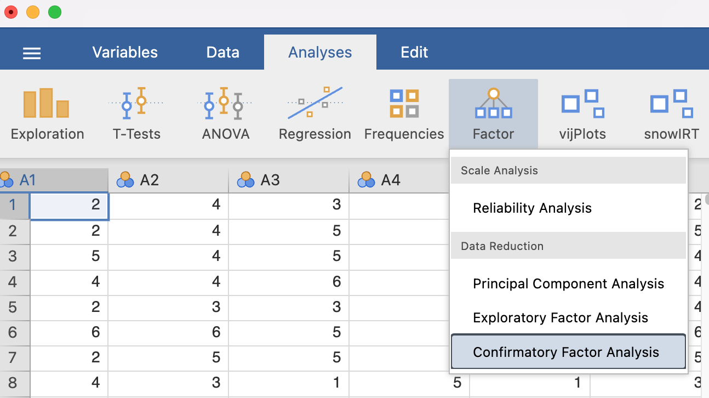
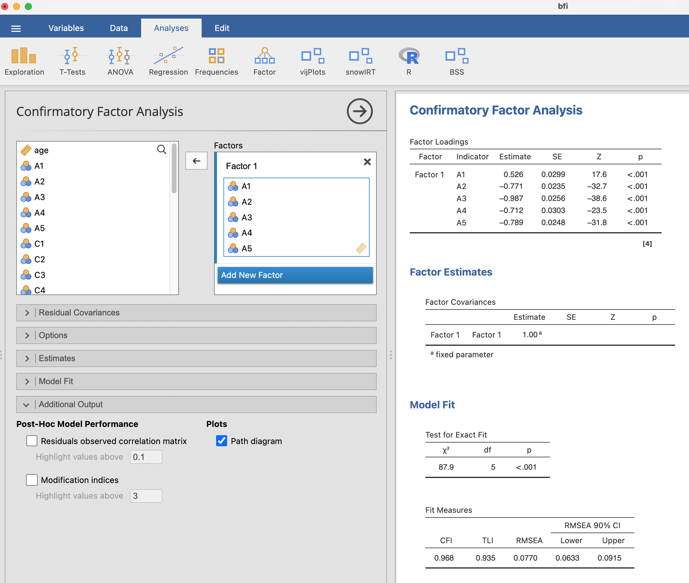

```{r}
#| echo: false
source("../assets/notes-setup.R")
```

In this handout, we will discuss how to assess the psychometric
properties of survey items and scales in R. We will cover reliability
analysis, item analysis, and factor analysis.

We will use the `bfi` dataset from
[here](https://raw.githubusercontent.com/Wenchao-Ma/Data/main/BFI/bfi.csv),
which contains item responses to Big Five personality items on a 1-6
Likert scale to show how to compute reliability in R. The dataset has 25
items, with 5 items for each of the Big Five traits: Extraversion (E),
Agreeableness (A), Conscientiousness (C), Neuroticism (N), and Openness
(O). To keep the example focused, we will analyze the 5 Agreeableness
items (`A1` to `A5`): A1 Am indifferent to the feelings of others.
(q_146)\
A2 Inquire about others' well-being. (q_1162) A3 Know how to comfort
others. (q_1206) A4 Love children. (q_1364) A5 Make people feel at ease.
(q_1419)

The code for loading the data is as follows:

```{r load-packages, message=FALSE}

library(psych)
library(tidyr)

# Load built-in dataset
bfi <- read.csv(
  "https://raw.githubusercontent.com/Wenchao-Ma/Data/main/BFI/bfi.csv"
)

# Select Agreeableness items
A_items <- bfi |>
	dplyr::select(A1:A5)

# Keep complete cases for simpler demonstration
A_complete <- A_items |>
	tidyr::drop_na()

dim(A_complete)
head(A_complete)

# Responses are on a 1-6 scale, so reverse-score with 7 - x
A_keyed <- A_complete |>
	dplyr::mutate(A1 = 7 - A1)

head(A_keyed)
```

## Item Analysis

Reliability analysis allows one to check if the test produces consistent
scores but it does not provide any insights into the quality of
individual items.

Item analysis lets us investigate the quality of these individual items,
including in terms of how well they contribute to the whole and improve
the validity of our measurement.

### Item Discrimination

In general, one would expect that respondents with a high level of
knowledge or skill would be **more** likely to answer an achievement or
aptitude item correctly than those with lower levels of knowledge, and
vice versa.

Similarly, in noncognitive tests, respondents with a high level of
construct would be more likely to agree or disagree a certain statement.

Item discrimination refers to how well an item differentiates between
respondents with different levels of the underlying construct.

- **Item-total correlation**: correlation between an item and the total
  score including that item.
- **Adjusted item-total correlation** (also called corrected item-total
  or item-remainder): correlation between an item and total score
  excluding that item.

The adjusted version is preferred because it avoids part-whole
inflation. We can use the `psych` package's `alpha()` function to
compute these statistics.

```{r item-discrimination-manual}
alpha_fit <- psych::alpha(A_keyed)
alpha_fit$item.stats
```

Below are the interpretation of each column:

- raw.r: The correlation of each item with the total score, not
  corrected for item overlap.
- std.r: The correlation of each item with the total score (not
  corrected for item overlap) if the items were all standardized
- r.cor: Item whole correlation corrected for item overlap and scale
  reliability
- r.drop: Item whole correlation for this item against the scale without
  this item
- mean: for data matrices, the mean of each item
- sd: For data matrices, the standard deviation of each item

::: {.note-box .note}
In applied work, adjusted item-total correlations around .30 or higher
are often considered minimally acceptable for early scale development,
with higher values indicating stronger discrimination.
:::

### Reliability Change If Item Deleted

This analysis asks whether the scale would become more or less reliable
if an item were removed. If reliability increases after deleting an
item, that item may be weakly aligned with the rest of the scale and
could be a candidate for removal.

::: {.note-box .note}
If reliability increases after deleting an item, that item may be weakly
aligned with the rest of the scale and could be a candidate for removal.
:::

```{r alpha-if-deleted}
psych::alpha(A_keyed)
```

### Inter-item Correlations

Inter-item correlations show how strongly items relate to each other.

- Very low correlations may suggest an item is off-construct.
- Very high correlations may suggest redundancy.

```{r interitem-correlation-table}
R_items <- cor(A_keyed)
round(R_items, 2)
```

```{r interitem-correlation-plot, fig.width=7, fig.height=5}
corrplot::corrplot(R_items, method = "number", type = "lower")
```

Average inter-item correlation is also useful:

```{r average-interitem}
mean_interitem <- psych::alpha(A_keyed)$total$average_r
mean_interitem
```

::: {.note-box .jamovi}
In Jamovi, Analyses -\> Factor -\> Reliabilty Analysis



:::

## Factor Analysis

The purpose of factor analytic techniques is to help us understand the
**number** and **nature** of the dimensions, or factors, underlying a
set of variables. In factor analysis, the word 'factor' is usually used
instead of the word 'construct', and we shall follow this convention
from now on.

Factor analytic studies address questions such as:

- How many factors are there?
- What do these factors represent?

If researchers do not know the number of factors measured by the test or
the structure of the test, they should use **EFA** to explore the
underlying structure. On the other hand, if researchers hypothesize a
particular number of factors that represent distinct aspects of a
construct, based on theory or prior research, and write items to measure
each factor, they may consider using **CFA** to confirm whether the data
support their hypothesized structure.

::: note-box
Factor analytic methods answer the question, "Why are these variables
correlated in the way we observe?" In factor analysis, the answer to
this question is that the variables are correlated through a common
cause: the factor(s).
:::

In what follows, we will analyze the items using CFA:

### Model specification

The Agreeableness Scale implies a single-factor model. Below we will
assess if a single-factor model is appropriate by using CFA based on the
data we have. The single-factor model can be represented using the
following diagram:

```{r}
#| echo: false
#| message: false
#| cache: true
#| fig-height: 6
#| fig-width: 6

library(lavaan)
library(semPlot)
label <- c(paste("A",1:5),"F")

model <- 'F =~ A1 + A2 + A3 + A4 + A5'
fit <- lavaan::cfa(model, data = A_keyed)
semPlot::semPaths(fit, exoCov = T, curvePivot = TRUE, sizeMan = 6, sizeInt = 5, 
                  residuals=T,nodeLabels = label)
```

There are several R packages for CFA, and we will use `lavaan` in this
class. To specify the single-factor model above for `lavaan`, we can
define the model using the following code:

- F represents the factor
- =\~ symbol connects the factor (on the left side) and all items
  associated with it (on the right side)
- By default, no error terms are correlated

```{r}
#| cache: true

library(lavaan)
model <- 'F =~ A1 + A2 + A3 + A4 + A5'
```

The following R code fits the single-factor model to the data:

```{r}
#| cache: true

fit <- lavaan::cfa(model, estimator = "MLR", data = A_keyed)
```

### Parameter estimation

In the above CFA model, we need to estimate 10 loadings and 10 error
variances, so there are 20 parameters that need to be estimated. The
following code will print their estimates:

```{r}
#| cache: true

lavaan::standardizedSolution(fit)
```

To understand the table above, keep in mind that:

- Standardized loading estimates can be found in column "est.std" for
  all items in rows with F =\~ itemX
- $\text{standardized loading}^2$ represents the proportion of variance
  of item scores explained by the factor
- Measurement error variances or residual variances for each item can be
  found in rows with itemX \~\~ itemX
- Measurement error variance = $1 - \text{standardized loading}^2$
- Measurement error variance represents the proportion of variance of
  item scores that cannot be explained by the factor

The estimates can also be printed using the `semPaths` function from the
`semPlot` package:

```{r}
#| cache: true
#| fig-height: 5
#| fig-width: 9
#| eval: false
#| echo: true
library(lavaanExtra)
lavaanExtra::nice_lavaanPlot(fit)
```

The code below prints the above fit indices along with many others:

```{r}
#| cache: true
#| fig-height: 5
#| fig-width: 9

lavaanExtra::nice_fit(fit)
```

:::{.note-box .jamovi}



:::

## Exercise

::: callout
## 

Please download the [Rosenberg Self-Esteem Scale (SES)
data](https://raw.githubusercontent.com/Wenchao-Ma/Data/main/SES/SES-data.csv)
for the following anlaysis.

- calculate coefficient alpha and omega.

- calculate item discrimination and alpha-if-item-deleted. Interpret the
  results.

- calculate inter-item correlation and draw the correlation plot.
  Interpret the results.

- (Optional) Fit a CFA model to the data and interpret the results.
:::
