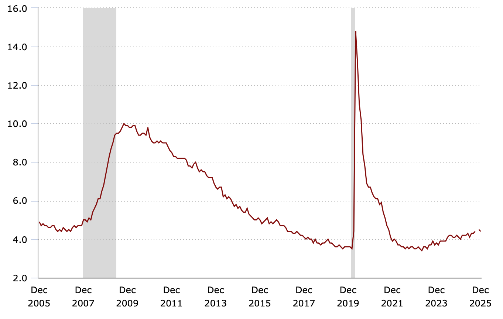
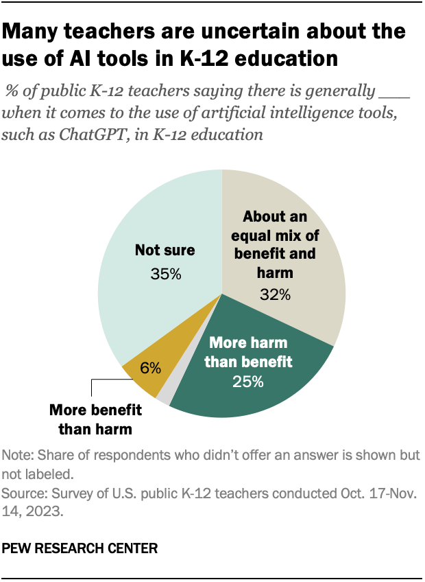
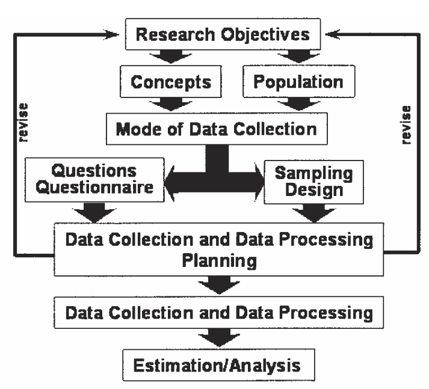

::: {.notes}

Most of you have probably taken a survey at one time or another, so you probably have a pretty good idea of what a survey is. Sometimes students in my research methods classes feel that understanding what a survey is and how to write one is so obvious, there’s no need to dedicate any class time to learning about it. This feeling is understandable—surveys are very much a part of our everyday lives—we’ve probably all taken one, we hear about their results in the news, and perhaps we’ve even administered one ourselves.
Over the semester we’ll move from big-picture ideas—like what counts as a survey and what surveys can answer—into practical choices about wording questions, selecting samples, choosing modes like online versus phone, and thinking about error and fairness. My goal is that you leave this course able to design a defensible survey study, critique surveys you encounter in the wild, and understand where survey results can go wrong.

:::

## Know Me, Know You

- Wenchao Ma, Ph.D.
- Associate professor in QME program at the Department of Educational Psychology
- Research interests:
  - Psychometric models for formative assessments
  - Use of machine learning and other statistical methods for education

::: {.notes}

Let me introduce myself briefly so you know where I’m coming from. I’m Wenchao Ma, and I’m an associate professor in the QME program in Educational Psychology. My research interests sit at the intersection of measurement and modeling—things like psychometric models, formative assessment, and how we can use machine learning and statistical methods to improve measurement in education. In this class, I’ll emphasize survey design not just as ‘writing questions,’ but as a measurement problem: what are we trying to measure, how do we measure it consistently, and how do we avoid bias and unfairness. And I’m also very interested in what you want to get out of the course.

:::

## Know Me, Know You

Some guiding questions:

- Are you a master, doctoral or undergraduate student?
- Which department/program are you from?
- Which year are you in?
- What is your research interests, if any (ok if you don’t have any yet)?
- Have you conducted any survey or used any survey before? If yes, how?
- Have you used SPSS or R before?
- Why do you take this course?

## Syllabus

## An Example: Unemployment Rate of The U.S.

*Source: https://data.bls.gov/pdq/SurveyOutputServlet*

{width="75%"}

::: {.notes}

I want to start with a concrete example you may already know: the U.S. unemployment rate. Most people heard about this number, but do you know how it is calculated?

:::

## An Example: Unemployment Rate of The U.S.

- Does the government use the number of people collecting unemployment insurance (UI) benefits under state or federal government programs?
- Does the government count every unemployed person each month?
- It is based on a survey with 60,000 eligible households and conducted every month
- From this survey, the unemployment rate was used to represent the national unemployment rate

{width="75%"}

::: {.notes}

Here are two common misconceptions: Some people think that to get these figures on unemployment, the government uses the number of people collecting unemployment insurance (UI) benefits under state or federal government programs. But some people are still jobless when their benefits run out, and many more are not eligible at all or delay or never apply for benefits. So, quite clearly, UI information cannot be used as a source for complete information on the number of unemployed.
Other people think that the government counts every unemployed person each month. To do this, every home in the country would have to be contacted—just as in the population census every 10 years. This procedure would cost way too much and take far too long to produce the data. In addition, people would soon grow tired of having a census taker contact them every month, year after year, to ask about job-related activities.
In reality, the unemployment rate is based on a recurring survey—about 60,000 eligible households, conducted monthly. The survey responses are used to estimate national unemployment. That matters because it means the result is an estimate with uncertainty, not a perfect count. It also means definitions matter: how we define ‘unemployed’ and how we ask questions about job search activity can change the estimate.

:::

## Another example: Attitude toward AI

A quarter of public K-12 teachers say using AI tools in K-12 education does more harm than good.

*Source: pewresearch.org/*

- When it comes to the use of artificial intelligence tools, such as ChatGPT, in K-12 education, do you think there is generally ____
- More benefit than harm
- More harm than benefit
- About an equal mix of benefit and harm
- Not sure
- No answer

{width="75%"}

::: {.notes}

Now let’s look at a different kind of survey output: attitudes and opinions. This example is about teachers’ views on AI tools in K–12 education. The survey asks respondents to choose among options like ‘more benefit than harm,’ ‘more harm than benefit,’ ‘about equal,’ or ‘not sure.’ Notice what’s happening here: we’re converting a complex belief into a response category. That conversion requires design decisions—like which options to include, how to label them.
Also notice the phrasing: ‘generally’ and ‘AI tools such as ChatGPT’—those words can influence interpretation. Attitude measurement is powerful, but it’s also sensitive to wording.

:::

## Another example: Attitude toward AI

They surveyed 2,531 U.S. public K-12 teachers from Oct. 17 to Nov. 14, 2023. The teachers are members of RAND’s American Teacher Panel, a nationally representative panel of public school K-12 teachers recruited through MDR Education.

::: {.notes}

the credibility of survey results depends heavily on the sample and data collection. Here, the study surveyed 2,531 U.S. public K–12 teachers over a defined field period, and the sample came from a specific recruitment source. Even before we argue about question wording, we should ask: who exactly was covered by the sampling frame, who responded, and who didn’t? What does ‘U.S. public K–12 teachers’ mean operationally, and does the sample actually match that target population? When you read a survey finding, train yourself to look for these basics: sample size, time window, recruitment method, and how respondents were identified.

:::

## Definition of survey

Based on Merriam-Webster, survey is:

- (v.) to query (someone) in order to collect data for the analysis of some aspect of a group or area
- (n.) the act or an instance of surveying

## Example questions answered by surveys

- What are people’s employment status, occupation, and industry?
- How satisfied are customers with a product?
- What are people’s political affiliations and voting intentions?
- How often do people engage in certain activities?
- How much do people know about a particular topic?
- What are people's views on a particular policy?
- What are their preferences for products, services, or features?

## Definition of survey

- A survey is a “systematic method for gathering information from (a sample of) entities for the purposes of constructing quantitative descriptors of the attributes of the larger population of which the entities are members” (Groves, et al., 2009)
- Some researchers use survey and questionnaire interchangeably.

::: {.notes}

The word "systematic" is deliberate and meaningfully distinguishes surveys from other ways of gathering information.
The phrase "(a sample of)" appears in the definition because sometimes surveys attempt to measure everyone in a population and sometimes just a sample.
The quantitative descriptors are called "statistics." Statistics are quantitative summaries of observations on a set of elements. The statistics attempt to describe basic characteristics or experiences of large and small populations in our world.
A survey collects information about a well-defined population. This population need not necessarily consist of persons. For example, the elements of the population can be households, farms, companies, or schools. Typically, information is collected by asking questions to the representatives of the elements in the population. To do this in a uniform and consistent way, a questionnaire is used.

:::

## Defining features of survey (Dalenius, 1985)

- A survey concerns a set of objects comprising a population.
  - Populations concerns a finite set of objects such as individuals, businesses, or farms.
  - The population of interest (referred to as the target population) must always be specified.

::: {.notes}

Dalenius starts with a simple but crucial point: a survey concerns a population—a defined set of objects like individuals, businesses, farms, and so on. That means the first discipline in survey design is specifying the target population clearly. Who exactly are you trying to make statements about? ‘Graduate students’ is different from ‘graduate students in education’ and different again from ‘first-year doctoral students in the Midwest.’

:::

## Defining features of survey (Dalenius, 1985)

- The population under study has one or more measurable properties.
  - A person’s occupation at a specific time
  - A person’s employment status
  - A person’s attitude or opinion
  - A person’s health condition

::: {.notes}

Once you define a population, you need to define what properties you want to measure. Surveys can measure things like occupation, employment status, attitudes, opinions, or health conditions—at least in principle. The key is that these properties must be operationalized. For something like occupation, you might ask for a job title and categorize it. For attitude, you need a construct definition and items that reflect it. This is where survey design overlaps strongly with measurement theory: you’re not just collecting answers; you’re constructing variables that represent properties of people or units.

:::

## Defining features of survey (Dalenius, 1985)

- Goal of the survey is to describe the population by one or more parameters defined in terms of the measurable properties.
- Examples of parameters are
  - the proportion of unemployed persons in a population at a given time
  - the total revenue of businesses in a specific industry sector during a given period, and
  - the number of wildlife species in an area at a given time.

## Defining features of survey (Dalenius, 1985)

- To get observational access to the population, a frame is needed
  - The frame population (also called sampling frame) is the set of persons for whom some enumeration can be made prior to the selection of the survey sample
  - It is an operational representation of the population units, such as a list of all objects in the population under study or a map of a geographical area

## Defining features of survey (Dalenius, 1985)

- A sample of objects is selected from the frame in accordance with a sampling design that specifies a probability mechanism and a sample size.
  - Every sampling design must specify selection probabilities and a sample size.
  - If selection probabilities are not known, the design is not statistically valid.

## Defining features of survey (Dalenius, 1985)

- Observations are made on the sample in accordance with a measurement process
  - Observations are collected by a mechanism referred to as the data collection mode.
  - Data collection can be administered in many different ways.
  - The observations can be made by means of
    - some mechanical device (e.g., electronic monitors or meters that record TV viewing behavior),
    - direct observation (e.g., counting the number of wildlife species on aerial photos), or
    - a questionnaire (observing facts and behaviors via questions that reflect conceptualizations of research objectives)

## Defining features of survey (Dalenius, 1985)

- Based on the measurements, an estimation process is applied to compute estimates of the parameters when making inference from the sample to the population.
  - The observations generate data.
  - The error in the estimates due to the fact that a sample has been observed instead of the entire population can be calculated

## Survey process (Biemer & Lyberg, 2003)

{width="75%"}

::: {.notes}

the survey process is composed of a number of steps that are executed more or less sequentially, from determining the research objectives to analyzing the data.
This part is from chapter 2 of Biemer, P. P., & Lyberg, L. E. (2003). Introduction to survey quality. John Wiley & Sons.

:::

## Determining the Research Objectives

- The primary estimates that will be produced from the survey results or the key data analyses that are to be conducted using the survey data
- Examples include
  - the proportion of students from underrepresented groups at UMN
  - The satisfaction of students about online instruction at UMN

{width="75%"}

## Determining what are to be measured

- Concepts or constructs
  - Manifest variables
    - Age
    - Income
    - GPA
  - Latent variables
    - Satisfaction
    - Attitude
    - Preference
- Latent variables may need to be measured with indicators

{width="75%"}

::: {.notes}

Defining concepts and constructs is critical, but not simple.
Employed
In the Current Population Survey (CPS), people are classified as employed if, during the survey reference week, they meet any of the following criteria:
worked at least 1 hour as a paid employee (see wage and salary workers)
worked at least 1 hour in their own business, profession, trade, or farm (see self-employed)
were temporarily absent from their job, business, or farm, whether or not they were paid for the time off (see with a job, not at work)
worked without pay for a minimum of 15 hours in a business or farm owned by a member of their family (see unpaid family workers)
For criteria 1 and 2, the work must be for pay or profit; that is, the individual receives a wage or salary, profits or fees, or payment in kind (such as housing, meals, or supplies received in place of cash wages). For the self-employed, this includes those who intended to earn a profit but whose business or farm produced a loss. See the definition of self-employed for further details.
Each employed person is counted only once in aggregate employment statistics from the CPS, even if they hold more than one job.
The following are not considered employment in the CPS.
volunteer work
unpaid internships
unpaid training programs
training programs not sponsored by an employer, even if the trainee receives a public assistance payment for attending
National Guard or Reserve duty (weekend or summer training)
ownership in a business or farm solely for investment purposes, with no participation in its management or operation
jury duty
work around one's home such as cleaning, painting, repairing, or other housework or home improvement project

:::

## Defining the Target Population

- The target population is the group of persons or other units for whom the study results will apply.
- It is also about which inferences will be made from the survey results.
- Examples include
  - All incoming undergraduates at UMN in 2024 fall
  - persons living in the United States who are aged 65 years or older and are enrolled in the Medicare system

{width="75%"}

## Determining the Mode of Administration

- The mode of administration can vary
  - Mail questionnaires
  - Internet (such as Qualtrics)
  - Telephone
  - Face-to-face
  - Multiple modes
- These decisions must be made before designing the questionnaire, since different modes of data collection often require very different types of questionnaires.
- The mode of administration will also constrain the sampling design choices that can be used for the survey.

{width="75%"}

::: {.notes}

Face-to-face interviewing will usually require a sample that is highly clustered (i.e., a sample composed of clusters of units such as persons living within the same neighborhoods). This is done to reduce interviewer travel costs. Telephone and mail survey samples are usually dispersed geographically. However, a telephone survey requires either a fairly complete list of telephone numbers for the persons in the target population or a practical and cost-effective method to generate a random sample of telephone numbers that is representative of the target population. A mail survey requires a fairly complete list of addresses for the persons in the target population. If an adequate address list is not available, a mail survey may not be possible.
In deciding on the mode of administration, one of the first constraints one encounters is costs. Face-to-face interviewing, even with highly clustered samples, can be several times more costly than collecting data by telephone or by mail.
Another important consideration relates to the topics to be surveyed. Interviewers can affect the responses to questions on sensitive topics, so if this is a concern, a more private mode of administration such as a mail self-administered questionnaire may be preferable.
Finally, to ensure an adequate response rate (about 75% is a typical minimum rate for U.S. government surveys), a telephone follow-up of the mail nonrespondents should also be included as part of the data collection design. Specifying one mode as a primary mode of administration and another mode as a secondary or follow-up mode is a common feature of data collection designs.

:::

## Developing the Questionnaire

- Questionnaires consist of questions or items for measurement
- Principles of measurement apply
  - Reliability
  - Validity
  - Fairness
- Question development may be affected by the mode of administration
  - Response time collection for internet survey

{width="75%"}

## Sampling Design

- sampling frame (i.e., the list of population members)
- methods used for randomly selecting the sample from the frame
- sample sizes

{width="75%"}

## Developing Data Collection and Data Processing Plans

- specifying the process of fielding the survey
- collecting the data,
- converting the data to computer-readable format,
- editing the data both manually and by computer

{width="75%"}

## Collecting and Processing the Data

- Recruiting interviewer
- Mailing questionnaires
- Monitoring return rates
- Training the telephone interviewers
- Cleaning data

{width="75%"}

## Estimation and Data Analysis

- Data weighting
- Handling missing responses
- Conducting statistical analysis and reporting findings

{width="75%"}

::: {.notes}

Weighting the data essentially involves determining an appropriate multiplier for each observation so that the sample estimates better reflect the true population parameter.

:::

## Classifications of Survey (Stoop, Harrison, 2012)

- Who: The Target Population
- What: The Topic
- By Whom: Survey Agency and Sponsor
- How: Survey Mode
- When: Cross-Sections and Panels
- Census vs. survey

::: {.notes}

This is from Stoop, I., & Harrison, E. (2012). Classification of surveys. In Handbook of survey methodology for the social sciences (pp. 7-21). New York, NY: Springer New York. (Reading material)

:::

## Who: The Target Population

- The target population (also called population of inference) is the finite set of the elements (usually persons) that will be studied in a survey.
- The target population may comprise businesses, households, individuals, days, journeys, etc.
- Examples include
  - Annual Business survey - business
  - Household Pulse Survey – household
  - Opinion poll - individual

::: {.notes}

In a business survey, information is collected on establishments or branches

:::

## What: The Topic

- An omnibus survey has no specific topic at all: data on a wide variety of subjects is collected
- Other surveys may have a focus
  - Wellbeing and happiness
  - Attitude toward AI/TikTok
  - Students’ satisfaction
  - Academic achievements

## By Whom: Survey Agency and Sponsor

- Surveys can be conducted by a wide range of agencies
  - Government agencies
    - National center for educational statistics (NCES)
    - U.S. Bureau of Labor Statistics
  - NGO/Think tanks
    - Pew Research Center
    - RAND
  - Academic researchers

## How: Survey Mode

- Interview surveys
  - face-to-face
  - telephone
- Self-completion surveys
  - Mail
  - online

::: {.notes}

Interviewers are especially helpful when the survey is long, more than one person in the household has to be interviewed or when additional information has to be collected.
In many surveys today, multiple modes are used. This might involve a drop-off self-completion questionnaire following a face-to-face survey, or a mixed-mode approach where web, telephone and face-to-face are deployed sequentially to maximise coverage and minimise costs.

:::

## When: Cross-Sections and Panels

- Cross-sections
  - Data are collected only once
- Repeated cross-sections
  - Data are collected multiple times
  - Different samples are used at different time points
- Longitudinal panel
  - Data are collected multiple times
  - The same sample is used for all time points
- Rotating panel
  - Data are collected multiple times
  - Samples consist of overlapped individuals

## Census vs. (Sample) Survey

- Census is a way to obtain information about a population by collecting data about all its elements
- Also called a complete enumeration
- Disadvantages
  - It is very expensive.
  - It is very time-consuming.
  - Large investigations increase the response burden on people.
  - Census is a (population) survey.
- Typically, when we talk about survey, we refer to a sample survey.

::: {.notes}

It is very expensive. Investigating a large population involves a lot of people (e.g., interviewers) and other resources. .
It is very time-consuming. Collecting and processing a large amount of data takes time. This affects the timeliness of the results. Less timely information is less useful. .
Large investigations increase the response burden on people. As many people are more frequently asked to participate, they will experience it more and more as a burden. Therefore, people will be less and less inclined to cooperate.

:::

## Which are surveys?

Presidential election poll

Final exam

IQ tests

- National assessment of educational progress
- (NAEP)

Customer satisfaction survey

2020 U.S. Census

GRE test

Job interview

## Some Common Challenges with Surveys

- They are inherently error-prone
- Self-report can be problematic
- They are often developed without research-based guidance
- Question-wording
- Cultural relevance
- Survey fatigue & nonresponse

## Survey Error

Two major categories (Fowler, 2015):

Errors related to who is answering the questions

Errors related to the questions themselves

- Population coverage
- Sampling
- Nonresponse

- Bias
- score reliability

## Self-Report

First major problem:

- Perceptions & desires get in the way of accurate reporting

Social desirability:

- Reluctance to tell the truth about attitudes or behaviors that could be perceived as negative or unflattering
- Tendency to overestimate positive behaviors and underestimate negative behaviors

## Self-Report

Second major problem:

- Responses are inaccurate due to human fallibility

Response variance:

- People don’t always have the ability to remember things as they happened
- People are influenced by biases whether they mean to be or not

## Example:

What are some of the problems with the following question?

How many times have you read a magazine in the last six months?

## Question Wording (Item Writing)

- Very difficult.
- Different words in a survey item produce different responses & impact the inferences we can make from the survey

## Cultural Relevance

Perspective in this class:

- Fairness in measurement (AERA, APA, & NCME, 2014)
  - All respondents should have an unobstructed opportunity to demonstrate their location on the construct
  - Characteristics unrelated to the construct should not influence measurement outcomes

